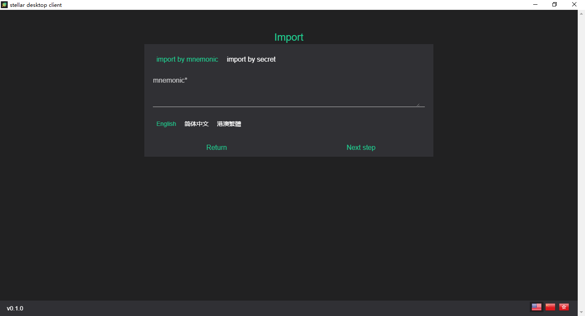
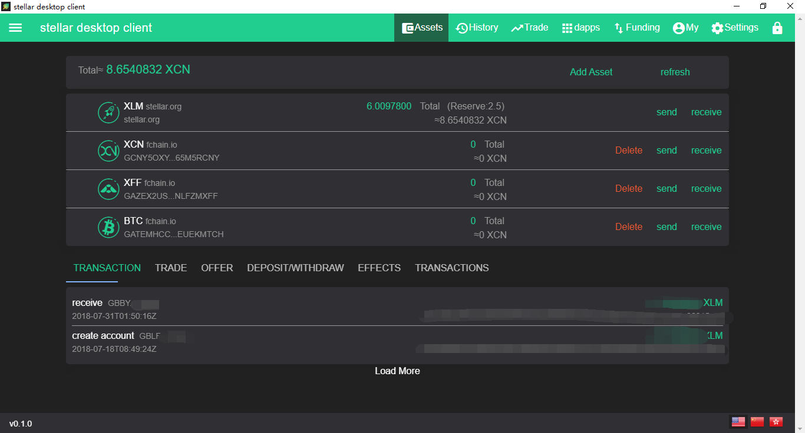
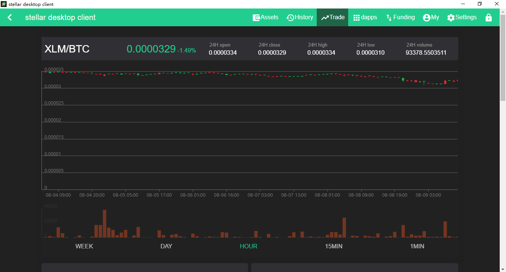
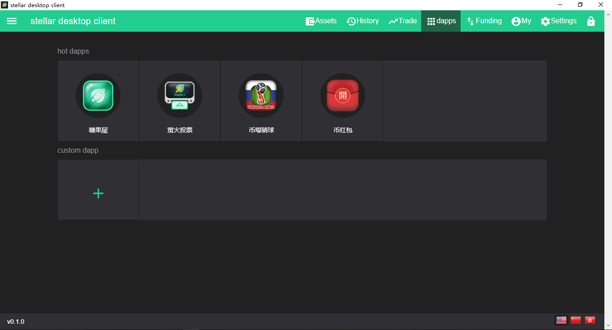
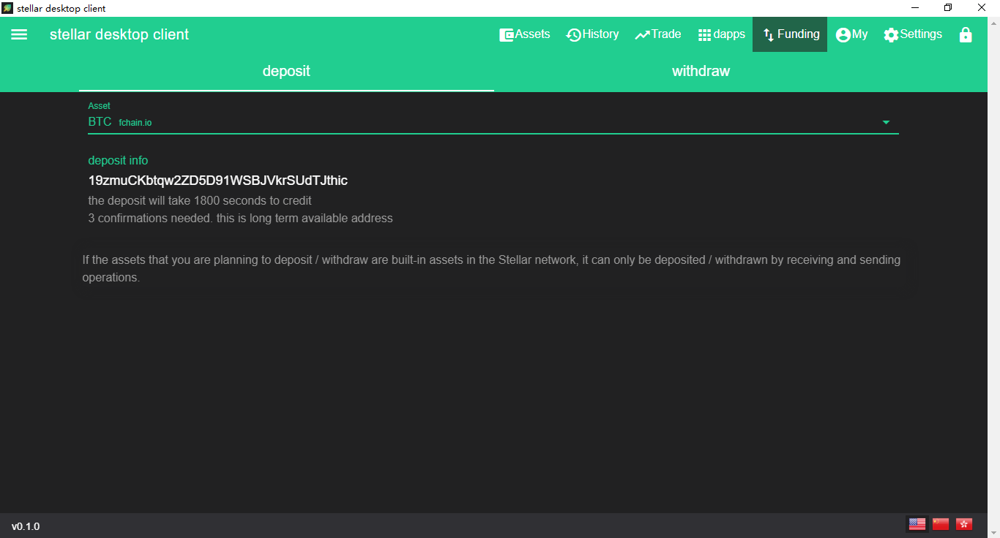
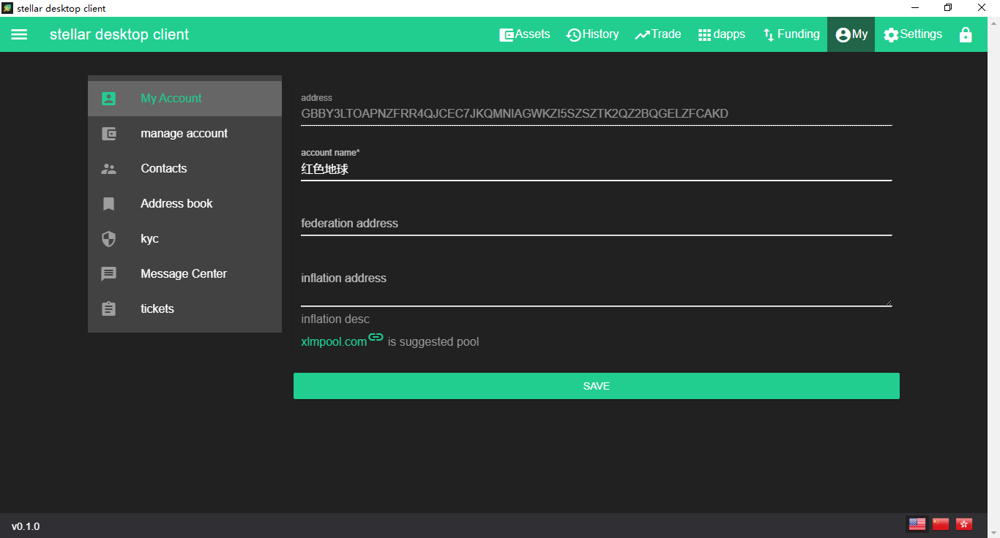

# polarstar

v0.1.0 released

polarstar is based on firefly wallet[https://github.com/stellarcn/firefly](https://github.com/stellarcn/firefly), use electron + vue, is full features desktop wallet.

## dev
git clone https://github.com/imloama/https://github.com/imloama/stellar-desktop-client.git
cd stellar-desktop-client
npm i # or yarn
npm run dev # or yarn dev

## build
git clone https://github.com/imloama/https://github.com/imloama/stellar-desktop-client.git
cd stellar-desktop-client
npm i # or yarn
### use electron-builder
npm run build # or yarn build
### use electron-packager
### build for win32
npm run pbuild:win32 # or yarn pbuild:win32
### build for linux
npm run pbulid:linux # or yarn pbuild:linux
### build for mac
npm run pbulid:darwin # or yarn pbulid:darwin

----
screenshots

